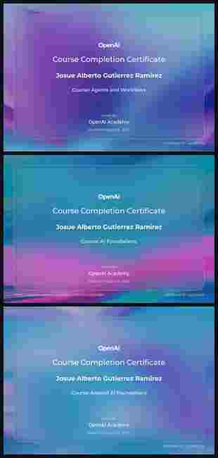

<!-- ========================================================= -->
<!--                     PERFIL JAGR DEV                       -->
<!-- ========================================================= -->

<p align="center">
  
</p>

<p align="center">
  <a href="https://github.com/jagrdev-MX"></a>
  <a href="mailto:jagr.developer@gmail.com"></a>
  <a href="https://www.youtube.com/@JAGRDEVELOPER"></a>
  <a href="https://frida-labs-web-oficial.vercel.app"></a>
</p>

<p align="center">
  
</p>

---

## 👨‍💻 Sobre mí

```text
Nombre      : Josue Alberto Gutierrez Ramirez
Alias       : JAGR DEV / jagrdev-MX
Ubicación   : México 🇲🇽
Enfoque     : Desarrollo de software · Android · Web · Backend · IA
Proyecto    : Frida Labs
Producto    : FridaMusic
Mentalidad  : Construir → Probar → Aprender → Mejorar → Repetir
```

Soy un desarrollador mexicano enfocado en crear **productos de software reales**, aprender nuevas tecnologías y convertir ideas en sistemas que puedan crecer.

Trabajo con **Android, plataformas web, servicios backend, automatización, arquitectura de software, inteligencia artificial y UI/UX**.

Actualmente desarrollo el ecosistema de **Frida Labs**, donde el desarrollo, la experimentación y el aprendizaje continuo se convierten en proyectos reales.

> **Que el código compile es solo el comienzo. El software tiene que funcionar en el mundo real.**

---

# 🧪 Frida Labs

<p align="center"><b>Laboratorio tecnológico independiente enfocado en software, productos digitales, infraestructura y proyectos experimentales.</b></p>

<p align="center">
  <a href="https://frida-labs-web-oficial.vercel.app"></a>
  <a href="mailto:fridalabs.soporte@gmail.com"></a>
</p>

Frida Labs nació de una idea personal y evolucionó hacia un proyecto tecnológico orientado a crear software escalable, experimentar y aprender mediante desarrollo real. Su primer gran proyecto es **FridaMusic**.

---

# 🚀 Proyectos destacados

## 🎵 FridaMusic

Ecosistema musical para Android enfocado en rendimiento, diseño y una experiencia de reproducción cuidada.

**Áreas principales:** Android / Kotlin · Media3 / ExoPlayer · reproducción remota y local · metadata y matching · backend · descargas · automatización · distribución en Google Play · plataforma web.

<p>
  <a href="https://github.com/jagrdev-MX/FridaMusicOF"></a>
  <a href="https://frida-music-of.vercel.app/"></a>
</p>

## 📦 XAPK / APKM Installer

Proyecto colaborativo relacionado con el ecosistema de Frida Labs, enfocado en instalación y flujos de paquetes Android.

**Formatos y áreas:** APK · APKM · XAPK · flujos de instalación Android · proyecto web complementario.

<p>
  <a href="https://github.com/juliocps25/APKMInstaller"></a>
  <a href="https://xapk-installer-web-frida-labs.vercel.app/"></a>
</p>

---

# 🧠 En qué estoy trabajando

```yaml
enfoque_actual:
  - FridaMusic
  - Frida Labs
  - Arquitectura Android
  - Plataformas web
  - Servicios backend
  - Inteligencia Artificial
  - Automatización
  - Rendimiento
  - UI/UX

aprendiendo:
  - Agentes y flujos de trabajo con IA
  - IA aplicada
  - Arquitectura de software
  - TypeScript / Next.js
  - Backend con Python
  - Infraestructura cloud
  - Flujos avanzados con Git
```

---

# ⚙️ Stack tecnológico

### Lenguajes
<p align="center"></p>

### Móvil y frontend
<p align="center"></p>

### Backend, cloud y herramientas
<p align="center"></p>

---

# 🤖 Inteligencia Artificial

La IA forma parte de mi flujo de desarrollo como herramienta para investigación, prototipado, depuración, automatización y análisis.

<p align="center">
  
  
  
  
</p>

> El código asistido por IA también debe entenderse, revisarse y probarse.

---

# 🎓 Certificaciones de OpenAI Academy

<p align="center"><b>Certificados de finalización · OpenAI Academy · 16 de agosto de 2026</b></p>

<p align="center">
  
</p>

<p align="center">
  <a href="https://academy.openai.com/home/certificate/tqjlqszg6s"></a>
  <br><br>
  <a href="https://academy.openai.com/home/certificate/z1nkv52xiq"></a>
  <br><br>
  <a href="https://academy.openai.com/home/certificate/susxi9q7ro"></a>
</p>

---

# 🏅 Habilidades verificadas · TrueCert

<p align="center"><b>Credenciales verificadas · agosto de 2026</b></p>

<p align="center">
  
</p>

- **Git Introduction — 92.3 %** · [Verificar credencial ↗](https://truecert.co/verify/80bbeb728d48c5ec71aa7226/?s=qr)
- **HTML & CSS Introduction — 90.3 %** · [Verificar credencial ↗](https://truecert.co/verify/51992e60f3b058eb8e1c0853/?s=qr)
- **AI Introduction — 100 %** · [Verificar credencial ↗](https://truecert.co/verify/12092f99ab913c74fab8b12f/?s=qr)
- **JavaScript Introduction — 100 %** · [Verificar credencial ↗](https://truecert.co/verify/0d73c7378e12efd8848a59bb/?s=qr)

---

# 📊 Analíticas de GitHub

<p align="center">
  
  
</p>

<p align="center"></p>

---

# 📈 Actividad y contribuciones

<p align="center"></p>

---

# 🧭 Filosofía de desarrollo

```text
01. Entender el problema.
02. Construir la solución correcta más pequeña posible.
03. Probarla con evidencia real.
04. Medir lo que realmente ocurre.
05. Mejorar sin romper lo que ya funciona.
06. Documentar lo importante.
07. Seguir aprendiendo.
```

---

# 🌎 Más allá de un proyecto

FridaMusic es el primer gran producto de Frida Labs, no el destino final.

Quiero seguir explorando y construyendo:

- 📱 Aplicaciones móviles
- 🌐 Plataformas web
- 🧠 Inteligencia Artificial
- ⚙️ Sistemas backend
- ☁️ Infraestructura cloud
- 🔌 APIs
- 🧪 Software experimental
- 🤝 Colaboraciones open source
- 🛠️ Herramientas para desarrolladores

---

# 📚 Aprendiendo actualmente

<p align="center">
  
  
  
  
  
</p>

---

# 🤝 Colaboración

Me interesa colaborar en proyectos relacionados con **Android, tecnología musical, IA, herramientas para desarrolladores, plataformas web, infraestructura backend, open source y software experimental**.

---

# 📫 Contacto

<p align="center">
  <a href="mailto:jagr.developer@gmail.com"></a>
  <a href="https://github.com/jagrdev-MX"></a>
  <a href="https://www.youtube.com/@JAGRDEVELOPER"></a>
  <a href="https://frida-labs-web-oficial.vercel.app"></a>
</p>

<p align="center"></p>

<p align="center"><b>JAGR DEV 🇲🇽</b><br><sub>Construyendo hoy el software que mañana será experiencia.</sub></p>

<p align="center"></p>
